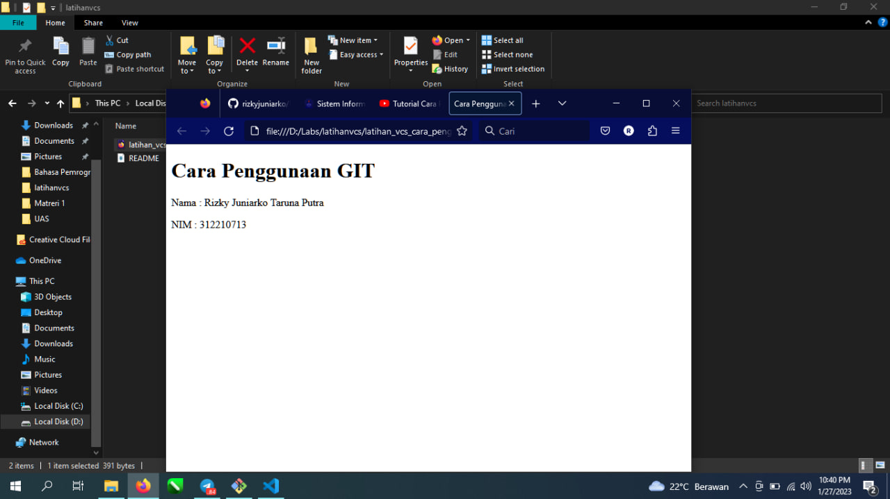

# latihanvcs
# Cara Penggunaan GIT

Login Ke Github Menggunakan Browser

Buat File Repository

Install Git Untuk Mobile di Google dengan keyword SCM, Pilih Download For windows

Makan Akan Muncul Tampilan Seperti ini, ketik pwd untuk melihat direktori, kita pindahkan direktori ke d dengan mengetik cd /d/Labs, lalu ketik git clone (paste alamat url yang ada di menu code pada git hub)

Maka Akan Muncul File yang bernama README.Md, buka file tersebut menggunakan Visual Studio Code

Buat File Baru dengan menekan CTRL+N 

Save Direktori dengan Format HTML

Ketikkan html:5

Ubah Nama Document Menjadi Cara Penggunaan GIT

Hasilnya Seperti ini

Buka File README.Md

Buat Folder Screenshoot 

Pilih Satu Foto yang mau diupload 

pada aplikasi git kita ketikkan git add screenshoot

pada aplikasi git lalu kita ketikkan git add commit -m "Menambahkan Screenshoot"

pada aplikasi git jangan lupa kita ketikkan git push -u origin main untuk menguplod ke githubnya

Bila ada perintah ini kalian masukan email dan username sesuai perintah dari gitnya seperti git congif --global user.Email"email kalian"
